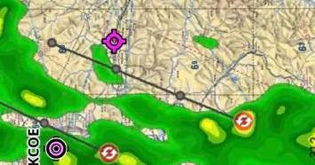
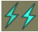
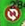

# ForeFlight Tips

The [ForeFight Users](https://www.facebook.com/groups/2036312003337297/) Facebook group has lots of great ForeFlight tips. I've started seeing some common themes and questions so through I would add a place to keep track of those.

<i>This repo is in no way affiliated with ForeFlight, A Boeing Company</i>

## Flight Planning

* How do I add a fuel stop to a flight plan?
	* Add `STAY/0030` to the the flight plan which means a 30m stop. The format is `STAY/HHMM` where `HH` = hours and `MM` = minutes
	* ForeFligh Blog [Adding A Stop](https://support.foreflight.com/hc/en-us/articles/360034183613-How-do-I-file-a-STAY-at-a-waypoint-within-my-flight-plan-in-Europe-?mobile_site=true&fbclid=IwAR0p6MjLbacYL6xXIqyhKbEzviUMON19Irgr8y6bqXF6hicteYiP3glnZpo)
	* This maybe a useful way to log cross country flights too so it shows up in ForeFlights reports.

## Weather

* Warning: AOPA: [NTSB WARNS OF IN-COCKPIT WEATHER DELAYS](https://www.aopa.org/news-and-media/all-news/2012/june/25/ntsb-warns-of-in-cockpit-weather-delays)
* Warning: [Accident Case Study: Time Lapse – misunderstanding in-cockpit weather displays can lead to tragedy](https://www.youtube.com/watch?v=83uvKWJS2os)

* [ForeFlight Radar Blog](https://blog.foreflight.com/2016/07/14/new-radar-layer-updates/?fbclid=IwAR09Divh5TJyqiDU-J6hMPeycPVYY-5QcQVaA7nDU4AHSZN4ZXRNmluZYMk)

### Storm Track

* ForeFlight blog on [Storm Tracks](https://blog.foreflight.com/2012/07/16/storm-tracks-now-available/)

___

**What do these lines with circles mean?**

* The line and circles extend outward from the storm cell and predict where the storm could be in `20`, `40`, and `60` minutes.
	
| Symbol | Meaning |
|---|---|
|  | Lightning (in last 5 minutes) |
| | Mesocyclone activity (Vortex of rising , rotating air) | 
|  | Tornado|
|   | Hail |
	
___

